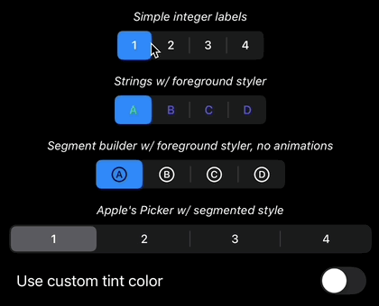

# BRHSegmentedControl

Swift package with a SwiftUI control that mimics the SwiftUI Picker using the segmented style.



Replicates the behavior of the native control:

* Drag the selected segment to change value
* Touch on an unselected segment to change value
* Cancel a touch by dragging away vertically from the segment

Visually, the replication is not exact, but it is IMO close. In particular:

* Touching on the selected segment shrinks the indicator by a small amount
* Touching on an unselected segment grays the text of the touched segment
* Segment dividers adjacent to the selected segment disappear
* All interface changes are animated just like the native control

Additional features:

* Honors the `accentColor` color out of the box (unlike the native control)
* Easy to create 1-based numeric segments - `.init(selectedIndex: $selected, count: 4)`
* Easy to create segments using text labels - `.init(selectedIndex: $selected, ["One", "Two", "Buckle", "Shoe"])`
* Segments can have their own custom views by providing your own `@ViewBuilder` method
* Supports custom styling of the segment view's foreground via your own `ShapeStyle` method
* Supports disabling animations via custom view modifier `disableAnimations`

# Using

Simply add the `brh-segment-control` package to your `Package.swift` file or add via Xcode.

```
  dependencies: [
    .package(url: "https://github.com/bradhowes/brh-segmented-control", from: "1.0.0"),
  ],
...
  .target(
    name: "MyView",
    dependencies: [
      .product(name: "BRHSegmentedControl", package: "brh-segmented-control")
    ]
  ),
```

For examples of how to use, see the `PreviewContent` struct in
[BRHSegmentedControl.swift](Sources/BRHSegmentedControl/BRHSegmentedControl.swift). There are also the unit tests that
exercise the API which show additional examples.

The default view builder methods are in
[BRHSegmentedControlSupport.swift](Sources/BRHSegmentedControl/BRHSegmentedControlSupport.swift). Creating custom ones
is easy and offers greater control of segment content. There are two versions, one taking one `Int` argument, and
another that takes an `Int` and a `String`. The second one is required when you provide a collection of strings in the
`init` method. The first argument is the segment's index to generate, and the second argument is the value from the
collection given in the `init`.

